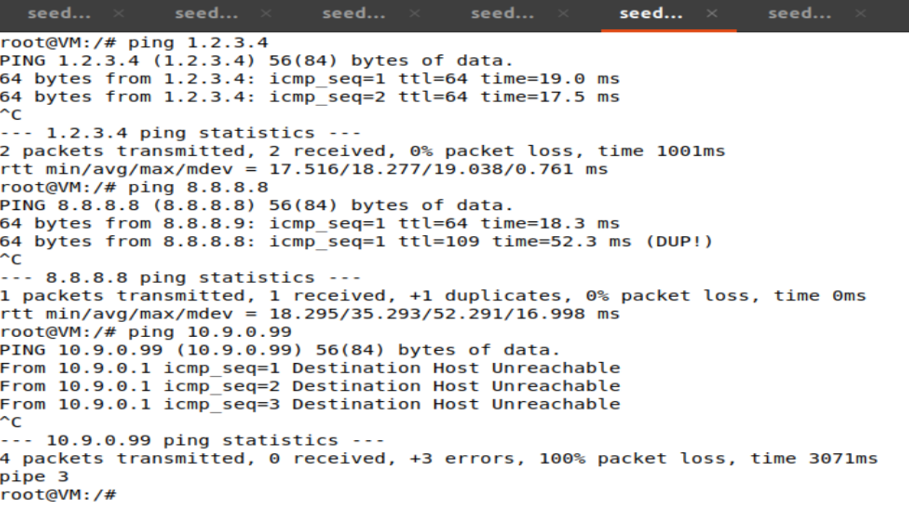
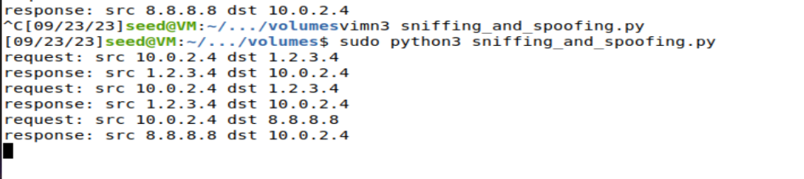

## 分工：
**set1部分：刘世杰 202122460170 全部完成**  

**set2部分： 牛中原 202100460123 全部完成**


# Task1.1 sniffing packets
实现sniff需要以下几个步骤：
+ 找到监听端口
+ 过滤想要监听的内容
+ 编写回调函数

sniffer.py文件如下
```python
#!/usr/bin/env python3
from scapy.all import *

print("start")

def print_pkt(pkt):
    print_pkt.num_packets+=1
    print("\n==============packet: {}===============\n".format(print_pkt.num_packets))
    pkt.show()

print_pkt.num_packets=0

# pkt = sniff(iface='br-78bb728863e7',filter='tcp && src host 10.9.0.1 && dst port 23',prn=print_pkt)


pkt=sniff(iface=['br-78bb728863e7','enp0s3'],filter='icmp',prn=print_pkt)

```


## task1.1A
sniffer.py捕捉到的数据包：


<div align=center></div>

如果没有root权限运行的话会产生PermissionError:

<div align=center></div>

这是因为在Linux系统上，以普通用户身份运行的程序通常没有权限访问网络设备。

## task1.1B
+ **Capture only the ICMP packet**
使用下面这行代码进行sniff
```python
pkt=sniff(iface=['br-78bb728863e7','enp0s3'],filter='icmp',prn=print_pkt)
```
捕获数据包的结果截图在task1.1A中，可以看到IP下的数据类型是ICMP

+ **Capture any TCP packet that comes from a particular IP and with a destination port number 23.**

换成下面这行代码sniff；
```python
pkt = sniff(iface=['br-78bb728863e7','enp0s3'],filter='tcp && src host 10.9.0.1 && dst port 23',prn=print_pkt)
```
在attacker容器中telnet 10.9.0.6可以产生tcp数据包：

<div align=center></div>

<div align=center></div>


+ **Capture packets comes from or to go to a particular subnet**

换成下面这行代码sniff：
```python
pkt = sniff(iface=['br-78bb728863e7','enp0s3','lo'],filter='dst net 128.230.0.0/16',prn=print_pkt)
```
使用scapy构建两个数据包发送并对捕获到的数据包进行验证可以看出，成功对一段subnet进行监听，发送和接收都可以成功捕获：


<div align=center></div>

<div align=center></div>

## Task1.2 spoofing ICMP packets

使用task1中的sniffer.py文件对attacker端口监听，在python的交互式命令行中发送不同源地址的ICMP数据包到10.9.0.1，如下截图表明，成功对echo request进行响应，说明构建成功：


<div align=center></div>
<div align=center></div>


## Task1.3 Traceroute

在本实验中，测试到github.com(IP地址为：20.205.243.166)
的路由数，ttl从1开始，不断增加，重复发送ICMP包，通过wireshark查看何时会接收到响应包
程序分为自动发包程序ttl.py和检查路由数量程序traceroute.py代码分别如下：
**ttl.py**
```python
#!/usr/bin/env python3 
  
from scapy.all import *

a = IP(dst = '20.205.243.166')

b = ICMP()

p = a/b

for i in range(1,64):
    a.ttl=i
    send(a/b)
```
**traceroute.py**
```python
#!/usr/bin/python3
  
from scapy.all import *

def print_pkt(pkt):
    if pkt[1].src=='10.0.2.4':
        print("ttl = {}:".format(pkt[1].ttl))
        return
    if pkt[1].src=='20.205.243.166':
        print("arrived dst!")
    else:
        print("not arrived dst")


pkt=sniff(iface=['br-78bb728863e7','enp0s3'],filter='icmp',prn=print_pkt)
```

最终得到结果，当ttl=29时获得来自github.com的响应：


<div align=center></div>

## Task1.4 Sniffing and-then Spoofing

```python
#!/usr/bin/python
from scapy.all import *

def send_packet(pkt):

    if ICMP in pkt and pkt[ICMP].type == 8:
        print("request: src {} dst {}".format(pkt[1].src,pkt[1].dst))
        ip = IP(src=pkt[1].dst,dst=pkt[1].src)
        if pkt[1].dst=='8.8.8.8':
            ip.src='8.8.8.9'
        icmp = ICMP(type=0,id=pkt[2].id,seq=pkt[2].seq)

        data=pkt[3].load
        newpkt = ip/icmp/data
        print("response: src {} dst {}".format(pkt[1].dst,pkt[1].src))
        send(newpkt,verbose=0)

interfaces = ['enp0s3','lo']
pkt = sniff(iface=interfaces, filter='icmp', prn=send_packet)
```
ping的三个地址如下：

<div align=center></div>

程序运行打印结果如下：

<div align=center></div>

+ ping 1.2.3.4时，需要把请求传给网关，网关接收到请求后伪造一个响应传给ping的src
+ ping 10.9.0.99 时，属于子网内部请求，不经过网关，所以不会被检测程序发现这个请求，然而子网内又没有这个地址，所以发生unreachable错误
<div align=center></div>

+ ping 8.8.8.8 时，虽然在真实网络环境中也可ping通，但是返回的实际上是我们伪造的请求包，特意将8.8.8.8修改为8.8.8.9可以看出这一点。

## Gain and experience 

1. 熟悉scapy的使用方法
2. 熟悉了网络数据包的结构和转发过程
3. 了解到许多docker和linux下的命令
4. 掌握利用scapy捕获修改数据包的内容


# Task 2:Writing programs to sniff and spoof packets

## Task 2.1:Writing packet sniff program

* sniff 程序需要能够识别捕获的数据包的类型，并提取出关键信息，如源目IP地址，报文类型等

* 为达到上述目的，需要定义以太网帧的头部，IP数据报的头部等信息，我们可以使用结构体定义：

```c
/* IP Header */
struct ipheader {
  unsigned char      iph_ihl:4, //IP header length
                     iph_ver:4; //IP version
  unsigned char      iph_tos; //Type of service
  unsigned short int iph_len; //IP Packet length (data + header)
  unsigned short int iph_ident; //Identification
  unsigned short int iph_flag:3, //Fragmentation flags
                     iph_offset:13; //Flags offset
  unsigned char      iph_ttl; //Time to Live
  unsigned char      iph_protocol; //Protocol type
  unsigned short int iph_chksum; //IP datagram checksum
  struct  in_addr    iph_sourceip; //Source IP address
  struct  in_addr    iph_destip;   //Destination IP address
};

/* Ethernet header */
struct ethheader {
  u_char  ether_dhost[6]; /* destination host address */
  u_char  ether_shost[6]; /* source host address */
  u_short ether_type;     /* protocol type (IP, ARP, RARP, etc) */
};
```

如上述，定义了IP头部和以太网帧头部的各个字段。

* 捕获数据包时，最重要的函数之一是pacp_loop()，它需要一个回调函数，以便每次嗅探到数据包时调用该函数，该回调函数负责完成数据包解析，打印字段等任务。

我们将回调函数命名为got_packet（）。

> 主函数部分

在函数主体，我们需要做的事情有如下几个：

* 设置要嗅探的网络设备

* 设置过滤器

* 创建嗅探会话

* 保持运行嗅探程序

```c
handle = pcap_open_live("enp0s3", BUFSIZ, 1, 1000, errbuf);
```

用于打开一个嗅探会话并获取会话句柄；

```c
if (pcap_compile(handle, &fp, filter_exp, 0, net) == -1) {
        fprintf(stderr, "Couldn't parse filter %s: %s\n", filter_exp, pcap_geterr(handle));
        return(2);
    }
    if (pcap_setfilter(handle, &fp) == -1) {
        fprintf(stderr, "Couldn't install filter %s: %s\n", filter_exp, pcap_geterr(handle));
        return(2);
    }
```

用于编译一个过滤器表达式，并将结果保存在过滤器程序中，以便后续在抓包过程中使用。

```c
pcap_loop(handle, -1, got_packet, NULL);

pcap_close(handle);   //Close the handle
```

运行嗅探程序以及关闭。

### Capture the ICMP packets between two specifific hosts

> 设置过滤器如下：


> 用另一个终端进入docker HostA，ping 10.9.0.1，嗅探结果如下：


### Capture the TCP packets with a destination port number in the range from 10 to 100

> 过滤器设置如下：


> 从docker HostA 发送telnet连接请求命令（TCP类型），得到结果如下:


### Sniffifing Passwords

我们可以借助scapy库，过滤出telnet的报文，并且打印报文原始内容


从docker Host A使用telnet命令尝试连接10.9.0.1，这时，在docker HostA中输入的字符，全部会作为数据报发送到10.9.0.1，也能被嗅探到，这时在嗅探程序上，就能看到输入的用户名及密码。


---

### answer questions:

##### 1,Question:  Please use your own words to describe the sequence of the library calls that are essential for sniffer programs.

Answer: 

```c
dev = pcap_lookupdev(errbuf)
pcap_lookupnet(dev, &net, &mask, errbuf)
handle = pcap_open_live(dev, BUFSIZ, 1, 1000, errbuf)
pcap_compile(handle, &fp, filter_exp, 0, net)
pcap_setfilter(handle, &fp)
pcap_loop(handle, -1, got_packet, NULL);
pcap_close(handle);   //Close the handle
```

大致为如上几步：确定网络设备，打开网络设备，设置过滤器，进行嗅探，关闭嗅探程序。

##### 2，Question:  Why do you need the root privilege to run a sniffer program? Where does the program fail if it is executed without the root privilege?

Answer:

嗅探数据包的过程很可能涉及到隐私数据，这部分数据除非由特权级的指令执行，否则不能访问，这涉及到隐私数据安全的问题，当用户不是特权级时，不能监听网络设备。

##### 3，Question:  Please turn on and turn off the promiscuous mode in your sniffer program. The value 1 of the third parameter in pcap open live() turns on the promiscuous mode (use 0 to turn it off). Can you demonstrate the difference when this mode is on and off? Please describe how you can demonstrate this.

Answer:

当 promiscuous mode（混杂模式）开启时，网络接口会接收到所有经过的数据包，无论这些数据包的目标地址是否匹配当前主机的 MAC 地址。而当 promiscuous mode 关闭时，网络接口仅接收与当前主机相关的数据包。

---

## Task 2.2 Spoofing

### Task 2.2 A: Write a spoofifing program.

* 写一个spoof程序，与前一个任务相同，都需要定义数据报的头部信息，但不同的是前者的目的是识别，后者的目的是创建一个新的数据报。

我们定义几个头部的结构体：

```c
/* Ethernet header */
struct ethheader {
    u_char  ether_dhost[6];    /* destination host address */
    u_char  ether_shost[6];    /* source host address */
    u_short ether_type;                     /* IP? ARP? RARP? etc */
};

/* IP Header */
struct ipheader {
  unsigned char      iph_ihl:4, //IP header length
                     iph_ver:4; //IP version
  unsigned char      iph_tos; //Type of service
  unsigned short int iph_len; //IP Packet length (data + header)
  unsigned short int iph_ident; //Identification
  unsigned short int iph_flag:3, //Fragmentation flags
                     iph_offset:13; //Flags offset
  unsigned char      iph_ttl; //Time to Live
  unsigned char      iph_protocol; //Protocol type
  unsigned short int iph_chksum; //IP datagram checksum
  struct  in_addr    iph_sourceip; //Source IP address
  struct  in_addr    iph_destip;   //Destination IP address
};

/* ICMP Header  */
struct icmpheader {
  unsigned char icmp_type; // ICMP message type
  unsigned char icmp_code; // Error code
  unsigned short int icmp_chksum; //Checksum for ICMP Header and data
  unsigned short int icmp_id;     //Used for identifying request
  unsigned short int icmp_seq;    //Sequence number
};

/* UDP Header */
struct udpheader
{
  u_int16_t udp_sport;           /* source port */
  u_int16_t udp_dport;           /* destination port */
  u_int16_t udp_ulen;            /* udp length */
  u_int16_t udp_sum;             /* udp checksum */
};
```

我们可以构建并发送原始数据包，此过程需要如下步骤：

1. 创建原始套接字：使用 `socket()` 函数创建一个原始网络套接字，指定地址族为 AF_INET（IPv4），套接字类型为 SOCK_RAW，协议类型为 IPPROTO_RAW（表示发送原始 IP 数据包）。

2. 设置套接字选项：使用 `setsockopt()` 函数设置套接字选项，将 IPPROTO_IP 和 IP_HDRINCL 作为参数传递给 `setsockopt()` 函数。IP_HDRINCL 表示在发送数据包时包含 IP 报头，而不是由系统自动添加 IP 报头。

3. 提供目标信息：将目标信息填充到 `sockaddr_in` 类型的 结构体中，包括目标的地址族（AF_INET）和目标 IP 地址 (iph_destip)。

4. 发送数据包：使用 `sendto()` 函数发送数据包。数据包的内容是通过参数传递给该函数的 `ip` 结构体指针，数据包长度通过 ntohs(ip->iph_len) 获取。目标地址和目标地址结构体也作为参数传递给 `sendto()` 函数。

5. 关闭套接字：使用 `close()` 函数关闭所创建的原始套接字。

关键步骤如下：

```c
struct sockaddr_in dest_info;
    int enable = 1;

    // Step 1: Create a raw network socket.
    int sock = socket(AFINET, SOCK_RAW, IPPROTO_RAW);
    printf("sock: %d\n", sock);

    // Step 2: Set socket option.
    setsockopt(sock, IPPROTO_IP, IP_HDRINCL,
                     &enable, sizeof(enable));

    // Step 3: Provide needed information about destination.
    dest_info.sin_family = AF_INET;
    dest_info.sin_addr = ip->iph_destip;

    // Step 4: Send the packet out.
    sendto(sock, ip, ntohs(ip->iph_len), 0,
           (struct sockaddr *)&dest_info, sizeof(dest_info));
    close(sock);
```

> UDP首部,IP首部字段赋值

函数的主体中，如果发送UDP报文，我们需要定义UDP的首部和IP的首部，并且给对应字段正确赋值。比如在UDP首部赋值时：

```c
udp->udp_sport = htons(12345);
   udp->udp_dport = htons(9090);
   udp->udp_ulen = htons(sizeof(struct udpheader) + data_len);
   udp->udp_sum =  0;
```

发送数据包时，可以在目的IP的docker监听网卡，就能监听到发送的数据包。

使用命令：

```c
tcpdump -i eth0 -n
```

监听本docker的网卡。

> 在主机(attacker)运行spoof 程序，在HostA监听到如下内容


**可以看到确实收到了UDP报文**

### Task 2.2 B:Spoof an ICMP Echo Request

* 当一个主机发送 ICMP Echo 请求时，它希望接收到一个 ICMP Echo Reply（回复）消息作为响应。这样的请求通常用于测试与目标主机之间的连通性。例如，当你在命令行中使用 "ping" 命令时，实际上就是发送一个 ICMP Echo 请求，并等待目标主机返回 ICMP Echo Reply 响应。

* 在 ICMP 协议中，Echo 请求（Type 8）和 Echo 回复（Type 0）消息都需要计算检验和,检验和值设置到 ICMP 头部的 Checksum 字段中。

因此我们需要写一个检验和计算的函数，TCP校验和在伪报头上计算，其中包括
TCP报头和数据，加上IP报头的一部分。

计算检验和的部分内容如下：

```c
while (nleft > 1)  {
       sum += *w++;
       nleft -= 2;
   }

   /* treat the odd byte at the end, if any */
   if (nleft == 1) {
        *(u_char *)(&temp) = *(u_char *)w ;
        sum += temp;
   }

   /* add back carry outs from top 16 bits to low 16 bits */
   sum = (sum >> 16) + (sum & 0xffff);  // add hi 16 to low 16
   sum += (sum >> 16);                  // add carry
   return (unsigned short)(~sum);
```

* 发送报文的过程与前一问类似，不同的是ICMP Echo需要构造ICMP报文头部，而前者是UDP首部。
  
  构造UDP首部如下:
  
  ```c
  struct icmpheader *icmp = (struct icmpheader *)
                               (buffer + sizeof(struct ipheader));
     icmp->icmp_type = 8; //ICMP Type: 8 is request, 0 is reply.
  
     // Calculate the checksum for integrity
     icmp->icmp_chksum = 0;
     icmp->icmp_chksum = in_cksum((unsigned short *)icmp,
                                   sizeof(struct icmpheader));
  ```

> 任意设置一个源IP，即使可能不存在的IP，在HostA依然可以收到伪造的报文。


> 监听HostA网卡，得到如下结果：


**可以看到确实收到了来自1.1.1.1的ICMP echo报文**

---

### answer questions

##### 4,Question:  Can you set the IP packet length fifield to an arbitrary value, regardless of how big the actual packet is?

Answer:

如果将 IP 包的长度字段设置为与实际包大小不一致的值，可能会导致网络传输过程中出现问题。接收方会根据 IP 包的长度字段来解析和处理数据，如果长度字段与实际包大小不匹配，可能会导致数据截断、解析错误或者被丢弃。

##### 5,Question:  Using the raw socket programming, do you have to calculate the checksum for the IP header?

Answer:

Raw Socket提供了对网络协议栈的底层访问，可以自定义 IP 包的内容和头部字段。在这种情况下，通常需要手动构建 IP 头部，并手动计算 IP 头部的检验和。

##### 6,Question:  Why do you need the root privilege to run the programs that use raw sockets? Where does the program fail if executed without the root privilege?

Answer:

这是因为 Raw Socket 提供了对协议栈的底层访问，使得开发者可以读写和修改低层网络协议的数据包。如果普通用户也能访问 Raw Socket，则可以导致系统安全风险，例如用户可以利用 Raw Socket 进行网络欺诈。如果在没有 root 权限的情况下尝试执行使用 Raw Socket 的程序，则通常会遇到权限不足的错误，无法创建 Raw Socket 和/或绑定到指定的网络接口上。原因是：进程需要 Root 权限才能打开 Raw Socket 以及发送/接收原始网络数据包。

---

### Task 2.3: Sniff and then Spoof

* sniff 之后再 spoof 的思路很简单，回想起前面的两个内容，我们可以发现，每次sniff到了数据包，我们就会调用回调函数，解析数据包内容，那么这样我们自然想到，如果在解析数据包后面加上发送的过程，就能实现目的了。

* 在回调函数中，添加spoof中发送数据包函数的功能，主体的函数部分，仍然是打开嗅探会话，监听某个网络设备，每次抓到数据包，进入回调函数，我们spoof一个数据包。

```c
void got_packet(u_char *args, const struct pcap_pkthdr *header,
                              const u_char *packet)
```

回调函数中增加spoof的内容。

注意我们仍需计算首部检验和。

注意过滤器的设置：按照要求我们应如下设置

```c
 char filter_exp[] = "icmp[icmptype]==icmp-echo";
```

这个过滤器可以用来捕获 ICMP 类型为回显请求的数据包，即捕获发送给本机的 Ping 请求数据包。

> got_packet()函数中加入spoof


> 在docker HostA  ping 1.1.1.1(下半),虽然命令不可达，但是还是被嗅探到


> 嗅探到后发送数据包


---

#### Gain and experience

> * 通过这次实验，我基本了解了网络嗅探和伪造并发送数据包的原理和实践，使用pcap库进行嗅探的主要步骤是设置要嗅探的设备，过滤，创建会话，运行嗅探。都可以调用pcap库函数去做，学到了过滤器的语法设置。
> 
> * 再次加强了计算机网络相关知识的熟练度，通过去写和观察IP报文头部，UDP报文头部等结构的字段，对计算机网络的相关内容更加了解。
> 
> * 学习到很多Linux上的操作方法和知识，比如在docker之间的连接和通信，监听网卡，以特权身份进入docker，挂载文件目录等操作。
> 
> * 从实践的角度再次学习了不同报文的含义，比如ICMP Echo请求报文，telnet 连接请求报文，ICMP的ping 报文等，大致了解了如何构建并发送不同类型的数据报，其中检验和的计算是首部字段重要的一部分。
> 
> * 了解到很多涉及数据安全和隐私的地方，比如嗅探操作需要特权级命令，因为涉及到隐私数据的安全，让我更加明白了网络安全的重要性和意义。
